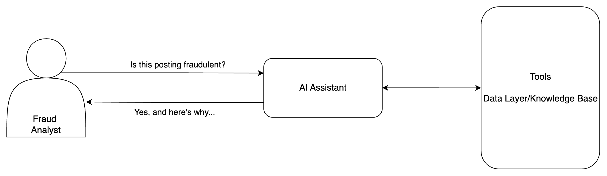

# Fraud Analyst Assistant - AI Project Canvas

## Problem
Company Y is a professional networking platform and is utilized
by job seekers and recruiters. This company
currently uses a rule-based system flags whether a job
posting is fraudulent or not. Alternatively, the company
receives complaints from people using their website on these suspicious
job postings. The role of fraud analysts
at this company is to determine the validity of these flags to ensure
they are not false-positives. Occasionally ticket volume can be
overwhelmingly high for the team to handle. 

## Goal
Create an AI assistant for the fraud analyst team to leverage
in resolving issues/tickets/complaints efficiently. 

## Concept Design

* End-users: Fraud Analysts
* Purpose: Identify whether a job posting is real or fake (fraudulent)

## Data & Knowledge
**Real/Fake Job Posting Dataset**

Based on the Kaggle dataset with 18K postings where 600 of them
are fraudulent. Consists of 18 columns including the following
text data points:
* Job title
* Salary range
* Company profile
* Job description
* Location of posting

Source: https://www.kaggle.com/datasets/shivamb/real-or-fake-fake-jobposting-prediction/data

### Possible Prompt types

| Prompt Category | Example |
|-----------------|--------|
| Classification |  "Is this job posting real or fake?" [Job posting text] |
| Explanation | "Why do you think this job posting is fake (real)" |
| Feature Extraction | "What features makes this job posting fake? |
| Comparison	|"Which of these two postings is more likely to be a scam? [Job 1] vs [Job 2]"|
|Step-by-Step	|"Evaluate this posting for fraud step by step. [job posting text]"|

## Resources & Stakeholders
* Director of IT/Fraud
* Director of Data Science
* Fraud Analyst
* Data Scientist

## Performance Metrics & Evals

- Retrieval quality
- End-to-End system performance (response time)
- Final answer scoring
- Task inference from user input
- Reasoning steps, tool user, and final responses.

## Deployment & Integration

**TBD**

## Timeline & Milestones

- RAG Prototyping - embedding models & vector DB 
- Prompt engineering
- Agentic system
